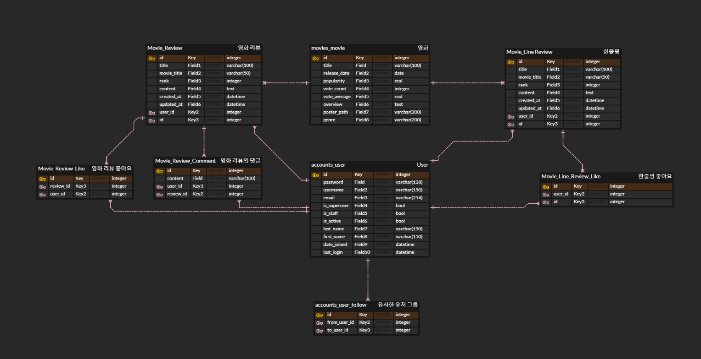
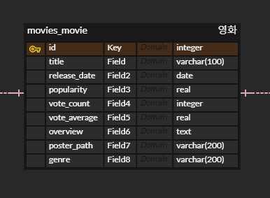
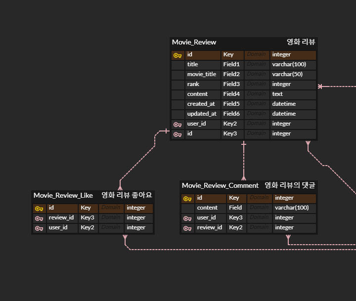
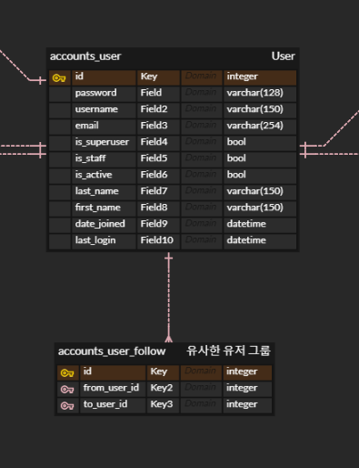
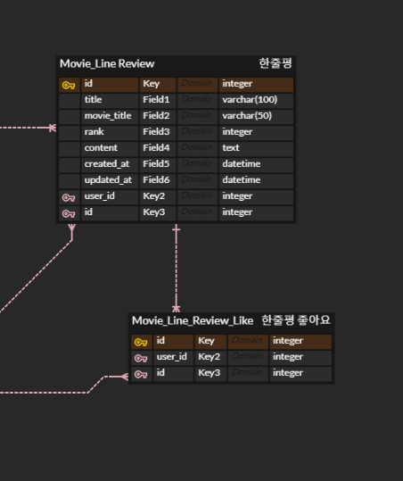

# Final_pjt

> 오픈 API 활용 영화 추천 알고리즘
>
> - 프로젝트 팀: 이강림, 오수완
>
> - 언어
>   - Python 3.7.8
>   - Node x.x.x
>   - Vue.js 2.6.x
> - 도구
>   - vsCode
>   - Chrome Browser
> - 아키텍처
>   - Django Rest API (서버) & Vue.js (클라이언트)

## day01_1119 

> 데이터 베이스 모델링 (ERD cloud)
>
> TMDB API 영화 데이터 추출

### 데이터 베이스 모델링(ERD)

- 사용자 / 영화 리뷰 / 영화 한줄평 / 영화 리스트 / 팔로우

- 영화

- 영화 리뷰

- 사용자
  - 팔로우 기능
    - 취향이 비슷한 사람들을 묶기 위한 기능(내부적으로 조작)
    - 사용자에게는 보이지 않음

- 한줄평

### 영화 추천 리스트

- 데이터 -> 네이버 API
  - 영화 레코드는 fixtures로 load
- 반응형 웹 -> bootstap grid 시스템
- 

### 요구사항

#### 관리자

- Django admin 계정
  - CRUD 가능
- Vue.js를  활용할 경우 Django Admin 페이지 기능 구현

#### 영화 정보

- fixtures 활용 데이터 저장 / 로드
- Authentication & Authorization - 인증 / 권한이 있는 사용자만 영화 리뷰를 남길 수 있다.

#### 추천 알고리즘

- 1개 이상의 알고리즘을 활용

#### 커뮤니티

> 구조를 명확히 나눠야 함 
>
> - 한줄평 / 리뷰를 

- 한줄평 -> 각 영화 

- 리뷰(게시판)