# 영화 추천 프로젝트 HOOCHA 🎞🎞🎞

## 프로젝트 개요

- TMDB open API의 Top rated 데이터 활용

- OpenWeather API 활용 날씨별 영화 장르 분류

- 프로젝트 기간: 2020년 11월 19일 ~ 2020년 11월 27일

- 프로젝트 팀원: 이강림, 오수완

- 1000개의 영화 데이터 / 6개의 날씨 분류

## 프로젝트 화면

### 로그인 / 회원가입 화면

- 회원가입 후 바로 메인 페이지 화면 전환

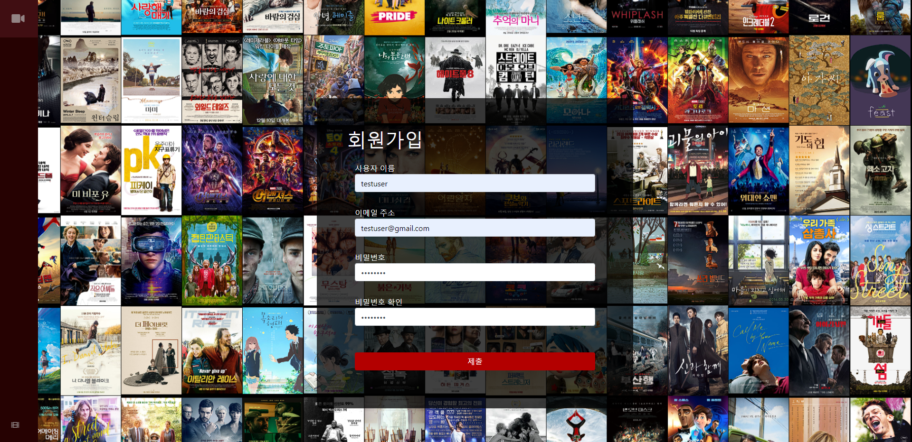

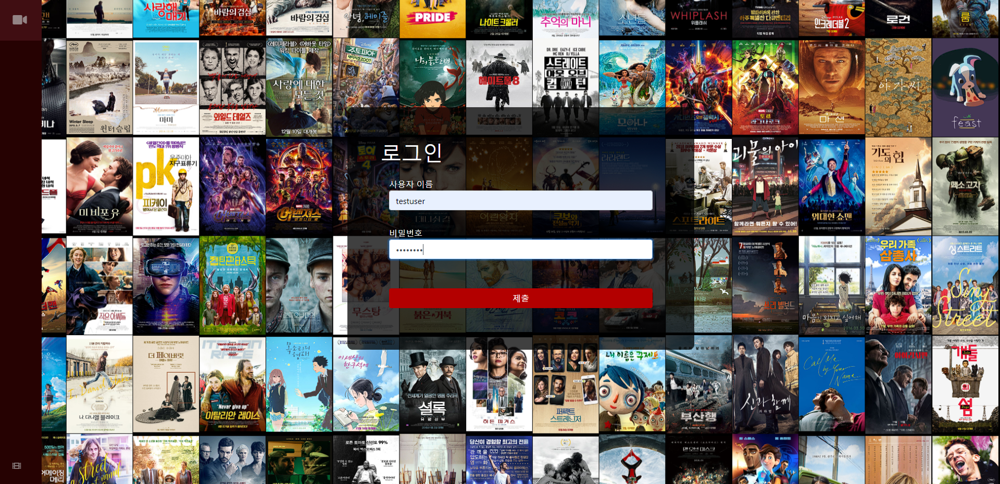

### 메인 화면 구성

- 좌측 네이게이션 바
  - 테마 변경 가능
  - 사용자 프로필 페이지 / 로그아웃 버튼
- 메인 화면
  - OpenweatherAPI를 활용한 날씨별 영화 추천
  - 장르별 영화 추천
  - 영화 클릭 시 디테일 화면 창 띄움(리뷰 작성 및 한줄평 남기기)

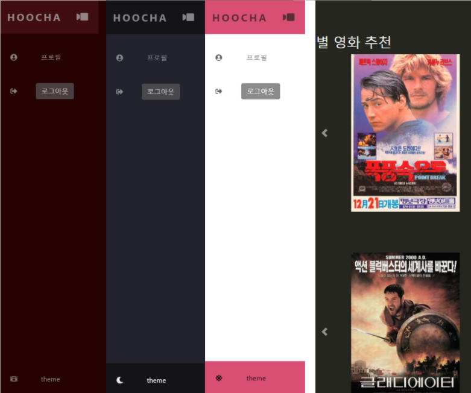

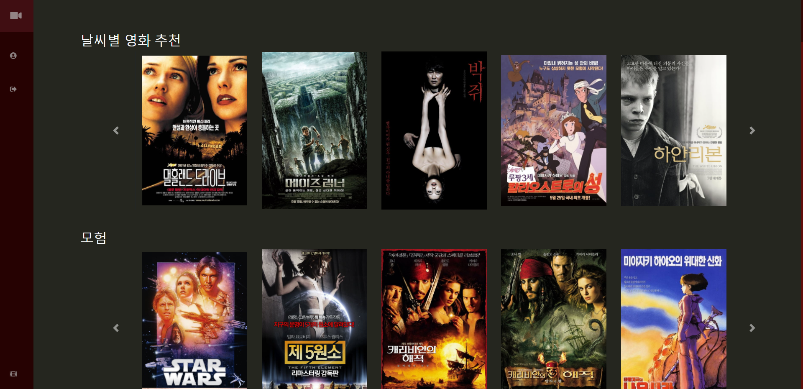

### 영화 상세 정보

- 영화 상세정보 페이지

- 좌측 네비게이션 바
  - 리뷰 및 댓글 작성
  - 한줄평 작성

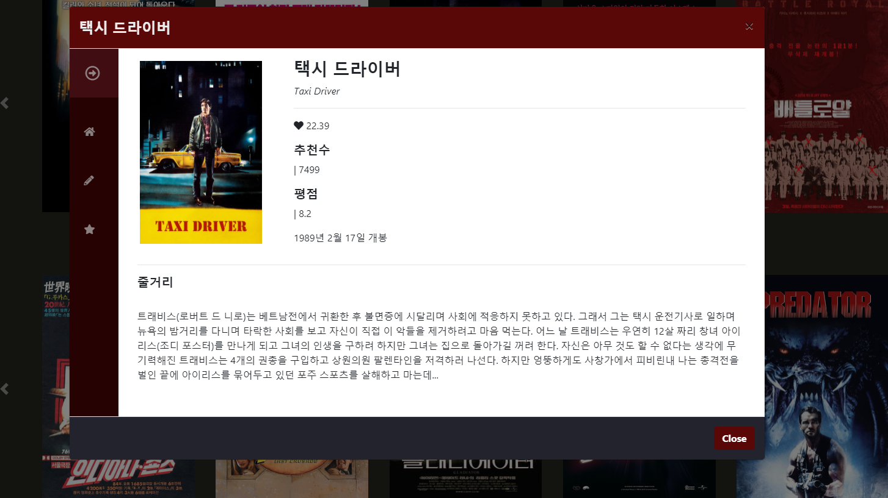

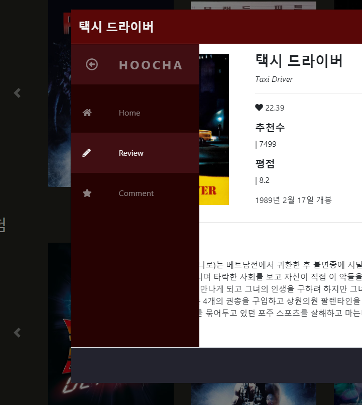

### 리뷰 / 댓글 작성

- 리뷰 작성
  - AJAX 요청으로 페이지 새로고침 없이 리뷰 생성 / 좋아요, 싫어요 기능 구현
  - 작성자만 수정 가능

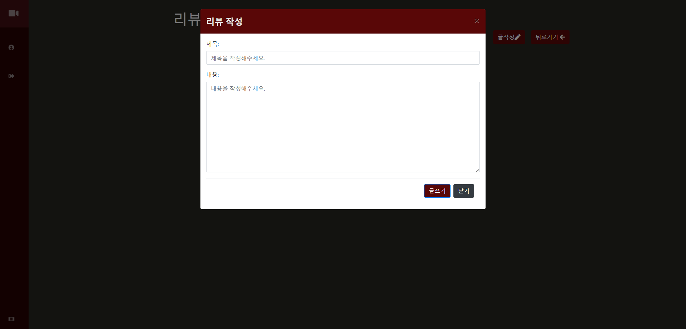

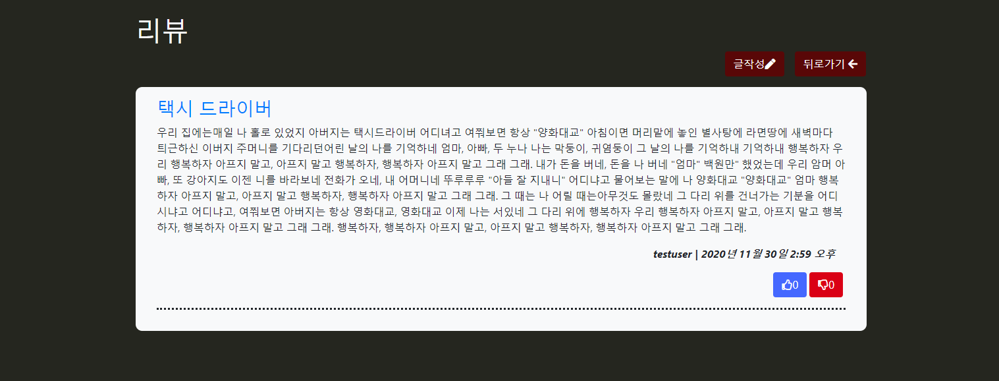

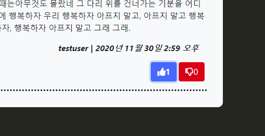

- 상세 리뷰 페이지
  - 작성자 글 수정 기능
  - AJAX 요청으로 댓글 CUD 기능 구현

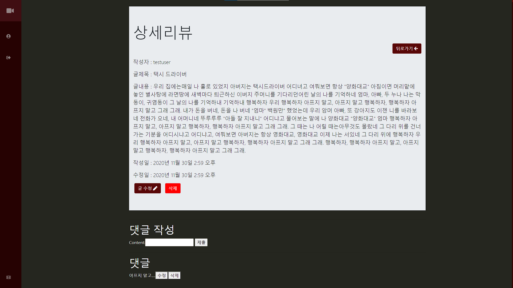

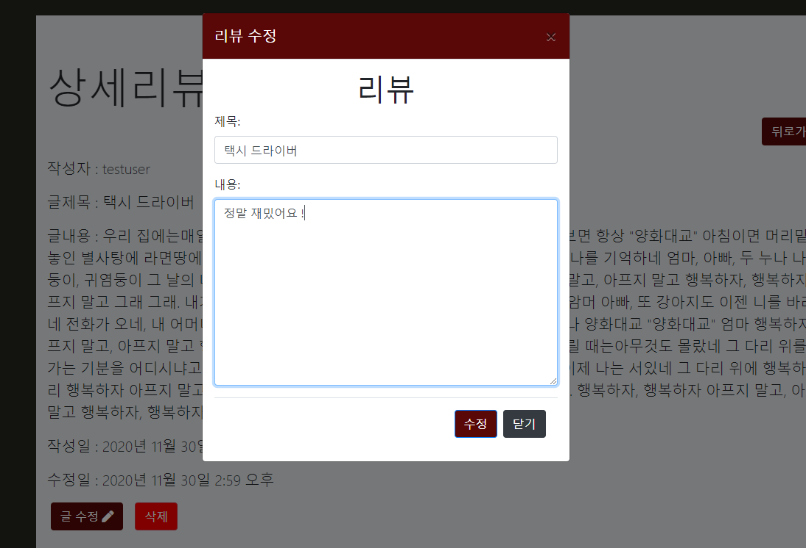

- 생성

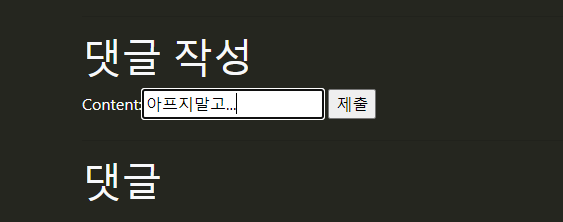

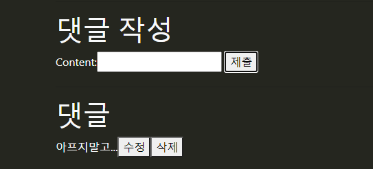

- 수정

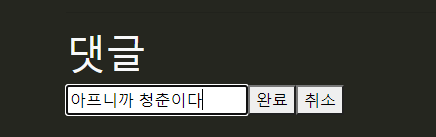

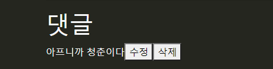

### 한줄평

- 한줄평 작성 기능
  - AJAX 요청으로 새로고침 없이 CUD 및 좋아요/싫어요 기능
  - 0~10점 평점 남기기
  - 평점 데이터 반영
    - 테스트를 위해 소숫자리 제거 x

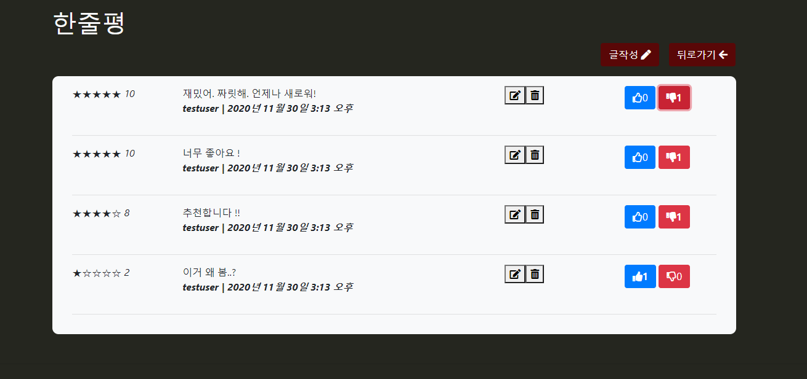

- 평점 반영

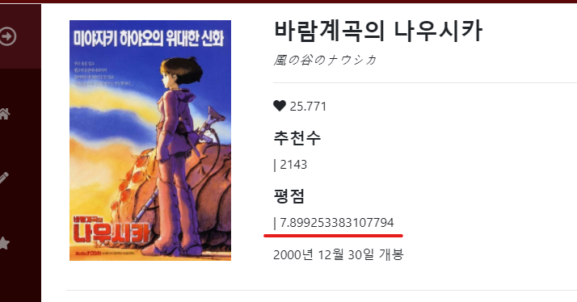

### 프로필 페이지

- 회원정보 수정 기능(비밀번호 변경, 이름 수정)
- 비밀번호 변경 클릭 시 비밀번호 변경 페이지로 이동

- 남긴 리뷰 / 댓글 확인

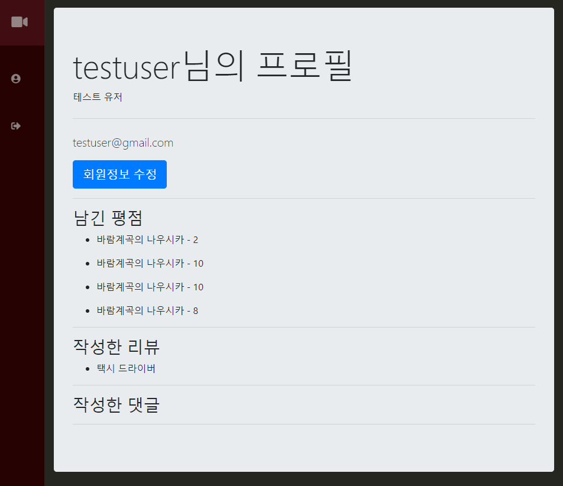

## 프로젝트 기능

### 데이터 베이스 모델링(ERD)

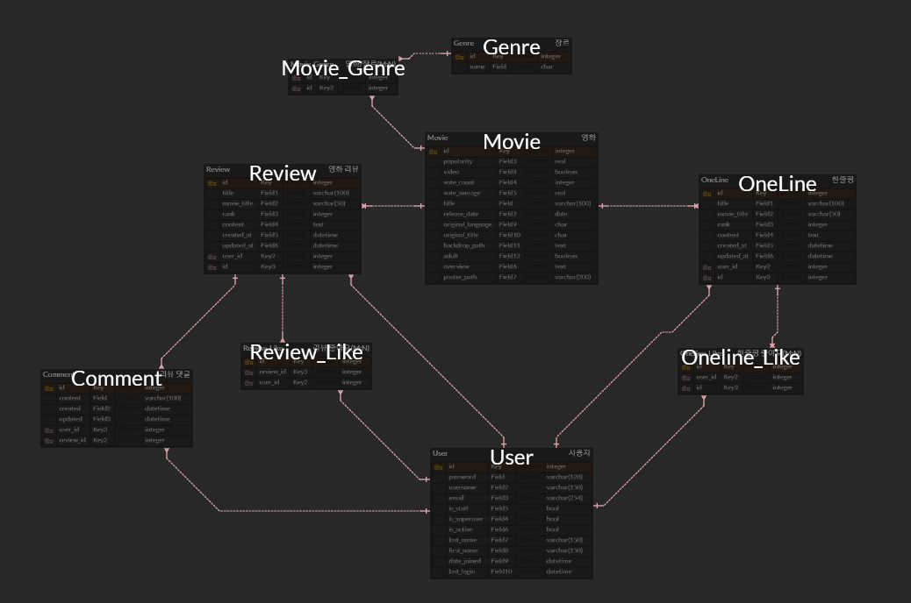

### 데이터 수집 및 가공

> **TMDB**
>
> - Top Rated / Popular / Detail 등 다양한 분류로 영화 데이터를 받아올 수 있음
> - 불특정 다수의 영화 데이터를 한 번에 가져올 수 있고, 데이터 가공에 유리하다고 판단하여 채택

#### API 활용 데이터 불러오기 및 가공

> 영화 데이터(약 400개)
>
> 장르 데이터(TMBD의 id값을 이용하여 string 타입으로 변환하여 장르 저장)
>
> 영화(M):장르(N) 중계 테이블 생성

#### 영화 테이블

- 약 400개의 데이터 저장

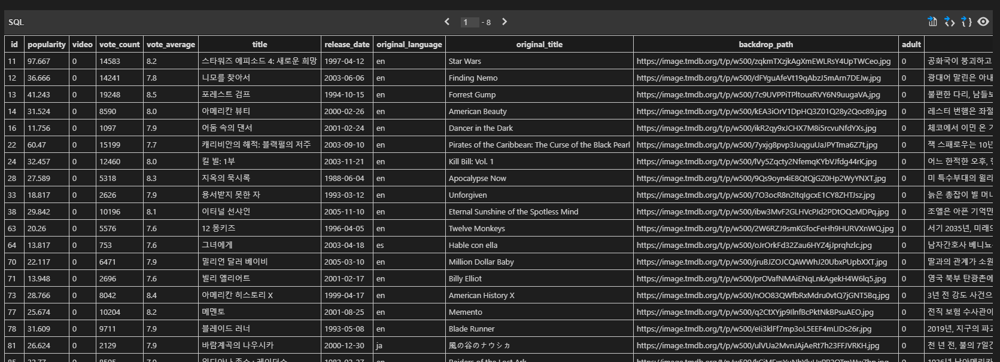

#### 장르 테이블

- 19개의 장르 데이터 저장

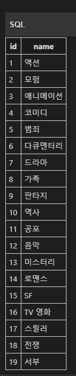

#### M:N 중계 테이블 (영화 : 장르)

- 하나의 영화가 다수의 장르를 가질 수 있음
- 장르별로 다수의 영화가 존재함
- 1089개의 중계 테이블 데이터 저장

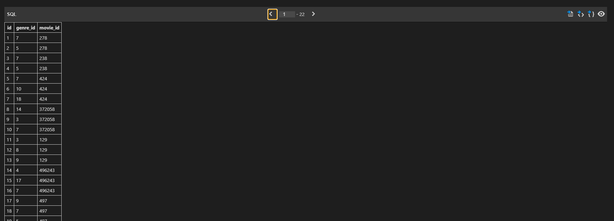

