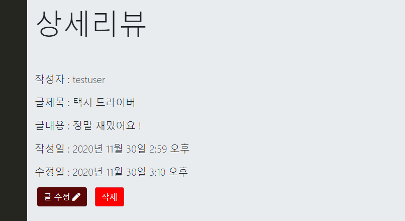

# 영화 추천 프로젝트

> 오픈 API 활용 영화 추천 알고리즘
>
> - 프로젝트 팀: 이강림, 오수완
>
> - 언어
>   - Python 3.7.8
>   - Node x.x.x
>   - Vue.js 2.6.x
> - 도구
>   - vsCode
>   - Chrome Browser
> - 아키텍처
>   - Django Rest API (서버) & Vue.js (클라이언트)


- [프로젝트 화면](#-------)
  * [로그인 / 회원가입 화면](#-------------)
  * [메인 화면 구성](#--------)
  * [영화 상세 정보](#--------)
  * [리뷰 / 댓글 작성](#----------)
  * [한줄평](#---)
  * [프로필 페이지](#-------)
- [기능](#--)
  * [데이터 베이스 모델링(ERD)](#------------erd-)
  * [데이터 수집 및 가공](#-----------)
    + [API 활용 데이터 불러오기 및 가공](#api-----------------)
    + [영화 테이블](#------)
    + [장르 테이블](#------)
    + [M:N 중계 테이블 (영화 : 장르)](#m-n-----------------)
    + [데이터 생성 코드](#---------)
- [dummy data](#dummy-data)

## 프로젝트 화면

### 로그인 / 회원가입 화면

- 회원가입 후 바로 메인 페이지 화면 전환


### 메인 화면 구성

- 좌측 네이게이션 바
  - 테마 변경 가능
  - 사용자 프로필 페이지 / 로그아웃 버튼
- 메인 화면
  - OpenweatherAPI를 활용한 날씨별 영화 추천
  - 장르별 영화 추천
  - 영화 클릭 시 디테일 화면 창 띄움(리뷰 작성 및 한줄평 남기기)


### 영화 상세 정보

- 영화 상세정보 페이지

- 좌측 네비게이션 바
  - 리뷰 및 댓글 작성
  - 한줄평 작성


### 리뷰 / 댓글 작성

- 리뷰 작성
  - AJAX 요청으로 페이지 새로고침 없이 리뷰 생성 / 좋아요, 싫어요 기능 구현
  - 작성자만 수정 가능


- 상세 리뷰 페이지
  - 작성자 글 수정 기능
  - AJAX 요청으로 댓글 CUD 기능 구현




- 생성


- 수정


### 한줄평

- 한줄평 작성 기능
  - AJAX 요청으로 새로고침 없이 CUD 및 좋아요/싫어요 기능
  - 0~10점 평점 남기기
  - 평점 데이터 반영
    - 테스트를 위해 소숫자리 제거 x


- 평점 반영


### 프로필 페이지

- 회원정보 수정 기능(비밀번호 변경, 이름 수정)
- 비밀번호 변경 클릭 시 비밀번호 변경 페이지로 이동

- 남긴 리뷰 / 댓글 확인


## 기능

### 데이터 베이스 모델링(ERD)


### 데이터 수집 및 가공

> 네이버 API / 영화 진흥 위원회 / TMDB의 API 활용 데이터 수집 결과
>
> - 네이버 
>   - 내가 원하는 영화 데이터를 뽑아오는 것은 활용도가 높음
>   - But, 불특정 다수(Top rated Movie / Popular Movie와 같은)의 영화 데이터를 한 번에 가져오는 것이 힘들다 판단하여 기각(취지에 어긋남)
> - 영화 진흥 위원회
>   - TMDB와 비교하여 구체적인 분류로 데이터를 가져오는 것이 힘들다 판단하여 기각
> - **TMDB**
>   - Top Rated / Popular / Detail 등 다양한 분류로 영화 데이터를 받아올 수 있음
>   - 불특정 다수의 영화 데이터를 한 번에 가져올 수 있고, 데이터 가공에 유리하다고 판단하여 채택

#### API 활용 데이터 불러오기 및 가공

> 영화 데이터(약 400개)
>
> 장르 데이터(TMBD의 id값을 이용하여 string 타입으로 변환하여 장르 저장)
>
> 영화(M):장르(N) 중계 테이블 생성

#### 영화 테이블

- 약 400개의 데이터 저장


#### 장르 테이블

- 19개의 장르 데이터 저장


#### M:N 중계 테이블 (영화 : 장르)

- 하나의 영화가 다수의 장르를 가질 수 있음
- 장르별로 다수의 영화가 존재함
- 1089개의 중계 테이블 데이터 저장


#### 데이터 생성 코드

```python
from django.shortcuts import render
import requests

from .models import Movie, Genre

def tmdb(request):
    API_URL = 'https://api.themoviedb.org/3/movie/top_rated'

    genres = [
        {
        "id": 28,
        "name": "액션"
        },
        {
        "id": 12,
        "name": "모험"
        },
        {
        "id": 16,
        "name": "애니메이션"
        },
        {
        "id": 35,
        "name": "코미디"
        },
        {
        "id": 80,
        "name": "범죄"
        },
        {
        "id": 99,
        "name": "다큐멘터리"
        },
        {
        "id": 18,
        "name": "드라마"
        },
        {
        "id": 10751,
        "name": "가족"
        },
        {
        "id": 14,
        "name": "판타지"
        },
        {
        "id": 36,
        "name": "역사"
        },
        {
        "id": 27,
        "name": "공포"
        },
        {
        "id": 10402,
        "name": "음악"
        },
        {
        "id": 9648,
        "name": "미스터리"
        },
        {
        "id": 10749,
        "name": "로맨스"
        },
        {
        "id": 878,
        "name": "SF"
        },
        {
        "id": 10770,
        "name": "TV 영화"
        },
        {
        "id": 53,
        "name": "스릴러"
        },
        {
        "id": 10752,
        "name": "전쟁"
        },
        {
        "id": 37,
        "name": "서부"
        }
    ]
	
    # genre_id(숫자) -> genre_name(string)으로 변환
    id2genre = {
        genre['id']: genre['name'] for genre in genres
    }
    # Genre 생성
    for genre_name in id2genre.values():
        genre_instance = Genre()
        genre_instance.name = genre_name
        genre_instance.save()

    genres = Genre.objects.all()
    for genre in genres:
        print(genre.name)

    # TMDB API를 활용하여 1 ~ 21 페이지에 해당하는 영화 정보 추출
    for page in range(1, 21):
        payload = {
            'api_key': '7571218b4ab42912852227b3b4ea629c',
            'language': 'ko-KR',
            'page': page,
            'region': 'KR',
        }
        response = requests.get(
            API_URL,
            params = payload,
        )
        # 20개의 영화 정보 생성
        movie_list = response.json().get('results')
        
        # movie_list(20개의 영화들)의 정보 중
        # movie(1개의 영화 정보)
        for movie in movie_list:
            # 영화 정보 가공
            if movie.get('backdrop_path'):
                movie['backdrop_path'] = 'https://image.tmdb.org/t/p/w500' + movie['backdrop_path']
            movie['poster_path'] = 'https://image.tmdb.org/t/p/w500' + movie['poster_path']
            movie['genre_names'] = [
                id2genre[genre_id] for genre_id in movie['genre_ids']
            ]

            # Movie 생성
            movie_instance = Movie()

            movie_instance.id = movie['id']
            movie_instance.popularity = movie['popularity']
            movie_instance.video = movie['video']
            movie_instance.vote_count = movie['vote_count']
            movie_instance.vote_average = movie['vote_average']
            movie_instance.title = movie['title']
            movie_instance.release_date = movie['release_date']
            movie_instance.original_language = movie['original_language']
            movie_instance.original_title = movie['original_title']
            movie_instance.backdrop_path = movie['backdrop_path']
            movie_instance.adult = movie['adult']
            movie_instance.overview = movie['overview']
            movie_instance.poster_path =movie['poster_path']

            movie_instance.save()

            # 중계 테이블 생성 (M:N)
            for genre_id in movie['genre_ids']:
                if id2genre.get(genre_id):
                    genre_instance = Genre.objects.get(name=id2genre[genre_id])
                    genre_instance.movies.add(movie_instance)


    movies = Movie.objects.all()
    for movie in movies:
        print(movie.title)

    return render(request, 'data/index.html')
```


## dummy data

- 네이버 API

```python
from django.shortcuts import render
import requests

from .models import Movie, Genre


def naver(request):
    payload = {
        'query': '인터스텔라',
    }
    headers = {
        'X-Naver-Client-Id': '7ptwva7zZrZdP2xgQCb9',
        'X-Naver-Client-Secret': '6EHPskOKjd',
    }
    response = requests.get(
        'https://openapi.naver.com/v1/search/movie.json',
        params = payload,
        headers = headers,
    )
    response_dict = response.json()
    pprint(response_dict)
    context = {
        'items': response_dict.get('items'),
    }
    return render(request, 'data/index.html', context)
```

- 영화 진흥 위원회

```python
from django.shortcuts import render
import requests

from .models import Movie, Genre

def kofic(request):
    API_URL = 'http://www.kobis.or.kr/kobisopenapi/webservice/rest/movie/searchMovieList.json'
    for i in range(1, 2):
        payload = {
            'key': 'a56b3a9ad2d444b6e20f9f1d8d00db28',
            'curPage': i,
            'itemPerPage': 100,
            'prdtStartYear': '2000',
            'prdtEndYear': '2020',
        }
        response = requests.get(
            API_URL,
            params = payload,
        )
        
        response_dict = response.json()
        pprint(response_dict)
        print(response.url)
    return render(request, 'data/index.html')
```

